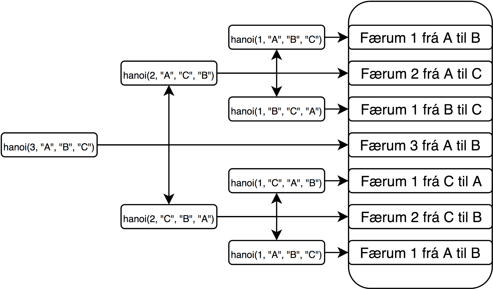

# Skilaverkefni 3
## Flow chart fyrir hanoi

## Flækjustig hanoi
#### 2<sup>n</sup> - 1

## Flækjustig
### O(n)
Gott dæmi um O(n) er Stalin Sort. Stalin sort er röðunar algrím sem fer í gegnum lista á lengd n, ber saman 2 stök í einu. Ef hægra stakið er stærra en vinstra stakið þá er það tekið úr listanum. Þú endar alltaf með raðaðan lista en ekki með 100% upplýsinga nákvæmni.
### O(n<sup>2</sup>)
Gott dæmi um O(n<sup>2</sup>) er þegar þú ert með nested for lykkjur að dýptinni 2.
### O(log(n))
Gott dæmi um O(log(n)) er þegar þú notar binary search til þess að leita í röðuðum lista.

## 4
```python
import operator as op
from functools import reduce
from itertools import combinations as comb
from time import perf_counter
from string import ascii_lowercase as low


def ncr(n, r):
    r = min(r, n-r)
    num = reduce(op.mul, range(n, n-r, -1), 1)
    denom = reduce(op.mul, range(1, r+1), 1)
    return num // denom

r=2

start = perf_counter()
l = ncr(26, r)
print("length calc:", l, "\ntime:", perf_counter() - start)

start = perf_counter()
l = list(comb(low, r))
print("comb calc:", l[0], ",", l[1], "...", l[-1], "\ntime:", perf_counter() - start)
```
## 5
```python
from itertools import combinations as comb
from time import perf_counter
from string import ascii_lowercase as low


def average(l):
    return sum(l)/len(l)


def find_pivot(l):
    pos = [0, len(l)//2, -1]
    pivot_list = [l[pos[0]], l[pos[1]], l[pos[2]]]
    l_len = len(l[0])
    return pos[pivot_list.index(min(pivot_list[0][:l_len], pivot_list[1][:l_len], pivot_list[2][:l_len]))]


def qsort(l):
    if len(l) <= 1:
        return l
    pi = find_pivot(l)
    l[-1], l[pi] = l[pi], l[-1]
    p = l[-1]
    i = -1
    for j, elem in enumerate(l[:-1]):
        if elem == p or min(elem, p) == elem:
            i += 1
            l[i], l[j] = l[j], l[i]
    l[i+1], l[-1] = l[-1], l[i+1]
    return qsort(l[:i+1]) + [l[i+1]] + qsort(l[i+2:])


l = list(map("".join, list(comb(low, 5))))[::-1]
start = perf_counter()
l = qsort(l)
print(perf_counter() - start)
print(l)

```
